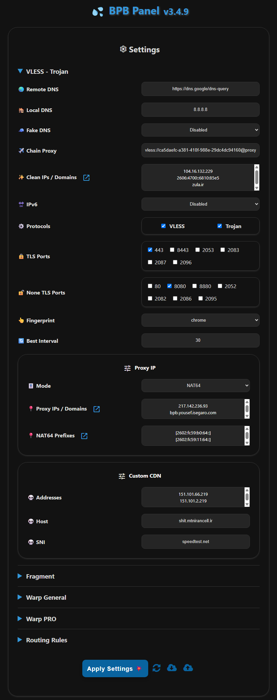

<h1 align="center">BPB 面板 💦</h1>

  

 

## 项目介绍

本项目旨在提供一个用户面板，用于访问免费、安全、私密的 **VLESS**、**Trojan** 和 **Warp** 配置，即使在域名或 Warp 服务被 ISP 封锁的情况下也能确保连接，提供两种部署方式：

- **Workers** 部署
- **Pages** 部署

## 功能特性

1. **免费且私密**：无需任何费用，服务器完全私密。
2. **直观面板**：为轻松导航、配置和使用而优化设计。
3. **多样化协议**：提供 VLESS、Trojan 和 Wireguard (Warp) 协议。
4. **Warp Pro 配置**：为关键情况优化的 Warp 配置。
5. **碎片支持**：为关键网络情况支持碎片功能。
6. **全面路由规则**：绕过伊朗/中国/俄罗斯和局域网，阻止 QUIC、色情、广告、恶意软件、钓鱼网站，同时绕过制裁。
7. **链式代理**：能够添加链式代理来修复 IP。
8. **广泛客户端兼容性**：为 Xray、Sing-box 和 Clash-Mihomo 核心客户端提供订阅链接。
9. **密码保护面板**：提供安全私密的面板，支持密码保护。
10. **完全可定制**：支持设置干净 IP-域名、代理 IP、DNS 服务器、选择端口和协议、Warp 端点等。

## 使用限制

1. **UDP 传输**：Workers 上的 VLESS 和 Trojan 协议无法正确处理 **UDP**，因此默认禁用（影响 Telegram 视频通话等功能），也不支持 UDP DNS。为增强安全性，默认启用 DoH。
2. **请求限制**：每个 Worker 每天支持 10 万次 VLESS 和 Trojan 请求，适合 2-3 个用户使用。您可以使用自定义个人域名来绕过 VLESS/Trojan 的限制（Workers 部署）或选择无限制的 Warp 配置。

## 开始使用

- [安装方法](https://bia-pain-bache.github.io/BPB-Worker-Panel/installation/wizard/)
- [配置指南](https://bia-pain-bache.github.io/BPB-Worker-Panel/configuration/)
- [使用教程](https://bia-pain-bache.github.io/BPB-Worker-Panel/usage/)
- [常见问题](https://bia-pain-bache.github.io/BPB-Worker-Panel/faq/)

## 支持的客户端

|       客户端        |     版本要求      |      碎片支持      |      Warp Pro      |
| :-----------------: | :--------------: | :----------------: | :----------------: |
|     **v2rayNG**     | 1.10.2 或更高版本 | :heavy_check_mark: | :heavy_check_mark: |
|     **v2rayN**      | 7.12.5 或更高版本 | :heavy_check_mark: | :heavy_check_mark: |
|   **v2rayN-PRO**    |  1.9 或更高版本   | :heavy_check_mark: | :heavy_check_mark: |
|      **Husi**       |                  | :heavy_check_mark: |        :x:         |
|    **Sing-box**     | 1.12.0 或更高版本 | :heavy_check_mark: |        :x:         |
|    **Streisand**    | 1.6.48 或更高版本 | :heavy_check_mark: | :heavy_check_mark: |
|      **V2Box**      |                  |        :x:         |        :x:         |
|  **Shadowrocket**   |                  |        :x:         |        :x:         |
|     **Nekoray**     |                  | :heavy_check_mark: |        :x:         |
|     **Hiddify**     | 2.5.7 或更高版本  | :heavy_check_mark: | :heavy_check_mark: |
|     **MahsaNG**     |   13 或更高版本   | :heavy_check_mark: | :heavy_check_mark: |
|   **Clash Meta**    |                  |        :x:         |        :x:         |
| **Clash Verge Rev** |                  |        :x:         |        :x:         |
|     **FLClash**     |                  |        :x:         |        :x:         |
|   **AmneziaVPN**    |                  |        :x:         | :heavy_check_mark: |
|    **WG Tunnel**    |                  |        :x:         | :heavy_check_mark: |

## 环境变量

|   变量名称   |               用途说明                |
| :----------: | :--------------------------------: |
|   **UUID**   |             VLESS UUID             |
| **TR_PASS**  |          Trojan 密码           |
| **PROXY_IP** | 代理 IP 或域名 (VLESS, Trojan) |
|  **PREFIX**  |   NAT64 前缀 (VLESS, Trojan)   |
| **SUB_PATH** |         订阅 URI         |
| **FALLBACK** |  回退域名 (VLESS, Trojan)   |
| **DOH_URL**  |              核心 DOH              |

---
